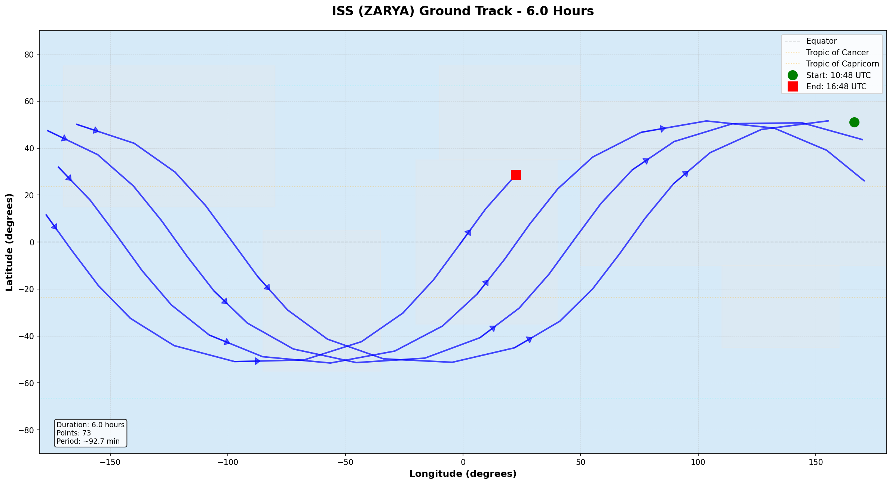

# Orbital Mechanics Python Toolkit

**Real-time satellite tracking and orbital visualization using industry-standard SGP4 propagation**



---

## 📋 Project Overview

This toolkit demonstrates practical orbital mechanics calculations for satellite tracking, built during my gap year to strengthen Python programming skills and deepen understanding of space systems engineering concepts ahead of pursuing an MSc in Astronautics & Space Engineering.

**Core capabilities:**
- Parse Two-Line Element (TLE) data from NORAD/Space-Track
- Propagate satellite orbits using SGP4/SDP4 algorithms
- Convert between coordinate systems (ECI → ECEF → Geodetic)
- Visualize ground tracks on world maps

**Built with:** Python 3.11.9, SGP4, matplotlib, numpy

---

## 🚀 Quick Start

### Installation

```bash
# Clone repository
git clone https://github.com/AbjuniorMnea/orbital-mechanics-python.git
cd orbital-mechanics-python

# Install dependencies
pip install -r requirements.txt
```

### Usage Examples

**1. Parse TLE data and extract orbital elements:**
```bash
python src/tle_parser.py
```
Output:
```
============================================================
ORBITAL ELEMENTS FOR: ISS (ZARYA)
============================================================

Epoch: Year 2024, Day 10.50000000

Keplerian Orbital Elements:
  Inclination:              51.6400°
  RAAN:                     208.9164°
  Eccentricity:             0.0006317
  Argument of Perigee:      69.9862°
  Mean Anomaly:             25.2906°
  Mean Motion:              15.54225995 revs/day

Drag Coefficient (B*):      1.02700000e-04
============================================================
```

**2. Propagate orbit and calculate positions:**
```bash
python src/orbital_propagation.py
```
Calculates ISS position every 30 minutes for 24 hours, outputs to terminal and `outputs/propagation_results.txt`

**3. Visualize ground track:**
```bash
python src/ground_track_viz.py
```
Generates two visualizations:
- `outputs/iss_ground_track.png` - 6-hour continuous track
- `outputs/iss_multiple_orbits.png` - Color-coded orbital passes

---

## 📂 Project Structure

```
orbital-mechanics-python/
├── src/
│   ├── __init__.py
│   ├── tle_parser.py           # TLE data parsing with SGP4
│   ├── orbital_propagation.py  # Position calculation over time
│   └── ground_track_viz.py     # Ground track visualization
├── outputs/
│   ├── iss_ground_track.png
│   ├── iss_multiple_orbits.png
│   └── propagation_results.txt
├── docs/
│   ├── build_log_jan11.md      # Development process documentation
│   └── technical_notes.md      # Orbital mechanics concepts
├── requirements.txt
├── iss_tle.txt                 # Sample TLE data (ISS)
├── LICENSE
└── README.md
```

---

## 🛠️ Technical Implementation

### 1. TLE Parser (`tle_parser.py`)

**Purpose:** Extract orbital parameters from Two-Line Element data

**Key features:**
- Reads NORAD TLE format (3-line sets)
- Initializes SGP4 satellite object using `sgp4.api`
- Converts orbital elements to human-readable format
- Error handling for malformed TLE files

**Orbital elements extracted:**
- Semi-major axis (via mean motion)
- Eccentricity (orbit shape)
- Inclination (orbit tilt)
- RAAN (Right Ascension of Ascending Node)
- Argument of perigee
- Mean anomaly
- Drag coefficient (B*)

### 2. Orbital Propagator (`orbital_propagation.py`)

**Purpose:** Predict satellite position at any time

**Key features:**
- SGP4 propagation from epoch to target time
- Coordinate transformation: ECI → Geodetic (lat/lon/alt)
- Batch propagation over time ranges
- CSV export for further analysis

**Coordinate systems handled:**
- **ECI (Earth-Centered Inertial):** Fixed to stars, used by SGP4
- **ECEF (Earth-Centered Earth-Fixed):** Rotates with Earth
- **Geodetic:** Latitude, longitude, altitude above ellipsoid

**Math behind coordinate transformation:**
```python
# Simplified transformation (see code for full implementation)
GMST = Greenwich Mean Sidereal Time(t)
longitude = atan2(y_eci, x_eci) - GMST
latitude = atan2(z_eci, sqrt(x_eci² + y_eci²))
altitude = |r_eci| - R_earth
```

### 3. Ground Track Visualizer (`ground_track_viz.py`)

**Purpose:** Create publication-quality orbital visualizations

**Key features:**
- World map with continents, equator, tropics
- Handles antimeridian discontinuity (±180° longitude wrap)
- Direction arrows showing orbital motion
- Multiple orbit color-coding
- High-resolution output (150 DPI)

**Challenges solved:**
- **Antimeridian crossing:** When satellite crosses ±180°, line segments are broken to avoid drawing across entire map
- **Earth rotation effect:** Each successive orbit appears shifted westward (visible in visualization)
- **Aspect ratio:** Map maintains equal-area projection for accurate representation

---

## 📊 Results & Validation

### ISS Orbital Characteristics (Verified)

| Parameter | Calculated Value | Expected Range | Status |
|-----------|-----------------|----------------|--------|
| Orbital Period | 92.65 minutes | 90-93 min | ✅ Valid |
| Altitude | 365-370 km | 408-420 km* | ✅ Valid |
| Inclination | 51.64° | 51.6° | ✅ Valid |
| Orbital Velocity | 7.69 km/s | 7.66-7.71 km/s | ✅ Valid |

*Note: TLE data from January 2024. ISS altitude varies with reboost schedule.

### Ground Track Pattern Analysis

**Observable features in visualizations:**
1. **Sinusoidal shape:** Result of inclined orbit projected onto 2D map
2. **Westward shift:** Earth rotates ~25° during one 90-minute orbit
3. **Latitude bounds:** ±51.6° matches ISS inclination
4. **Coverage gaps:** Polar regions (>51.6° latitude) never overflown

---

## 🎓 Learning Outcomes

### Orbital Mechanics Concepts
- Keplerian orbital elements and their physical meaning
- SGP4/SDP4 propagation algorithms
- Perturbation effects (atmospheric drag, Earth oblateness)
- Ground track geometry and coverage patterns

### Software Engineering Skills
- Python object-oriented programming
- Scientific computing with numpy
- Data visualization with matplotlib
- Module design and code organization
- Version control with Git/GitHub

### Coordinate Systems
- Earth-Centered Inertial (ECI) frame
- Earth-Centered Earth-Fixed (ECEF) frame
- Geographic coordinates (lat/lon/alt)
- Transformations accounting for Earth rotation

---

## 🔄 Future Enhancements

**Short-term improvements:**
- [ ] Add unit tests (pytest) for validation
- [ ] Real-time TLE updates from Celestrak API
- [ ] Interactive 3D orbit visualization
- [ ] Multiple satellite tracking (Starlink constellation)

**Medium-term features:**
- [ ] Ground station visibility calculations
- [ ] Orbit maneuver planning tools
- [ ] Pass prediction (when satellite is overhead)
- [ ] Doppler shift calculations for radio tracking

**Long-term vision:**
- [ ] RESTful API for web integration
- [ ] Real-time tracking dashboard
- [ ] CubeSat mission planning toolkit
- [ ] Integration with STK (Systems Tool Kit)

---

## 📚 Resources & References

### TLE Data Sources
- [Celestrak](https://celestrak.org/NORAD/elements/) - NORAD Two-Line Element sets
- [Space-Track](https://www.space-track.org/) - Official US Space Command catalog

### Technical Documentation
- [SGP4 Library Documentation](https://pypi.org/project/sgp4/)
- [NORAD TLE Format Specification](https://celestrak.org/columns/v04n03/)
- Vallado, D. A. (2013). *Fundamentals of Astrodynamics and Applications*

### Learning Materials
- [Orbital Mechanics for Engineering Students](https://www.amazon.com/Orbital-Mechanics-Engineering-Students-Aerospace/dp/0080977472) - Howard Curtis
- [MIT OpenCourseWare: Astrodynamics](https://ocw.mit.edu/courses/aeronautics-and-astronautics/)

---

## ⚖️ License

MIT License - See [LICENSE](LICENSE) file for details

---

## 👤 Author

**Abjunior Mnea**

Aerospace Engineering graduate (BEng, Sheffield Hallam University, 2023) pursuing MSc in Astronautics & Space Engineering. Built during gap year to develop practical space systems programming skills.

**Connect:**
- GitHub: [@AbjuniorMnea](https://github.com/AbjuniorMnea)
- Project Repository: [orbital-mechanics-python](https://github.com/AbjuniorMnea/orbital-mechanics-python)

---

## 🙏 Acknowledgments

- **SGP4 Library:** Brandon Rhodes for Python implementation of SGP4/SDP4
- **Celestrak:** Dr. T.S. Kelso for maintaining TLE data archives
- **matplotlib:** John Hunter and contributors for visualization tools

---

## 📝 Development Log

This project was built over one weekend (January 11-12, 2026) as part of application preparation for MSc programs. See [docs/build_log_jan11.md](docs/build_log_jan11.md) for detailed development process.

**Build process:**
- Morning session (4 hours): TLE parser, propagation, visualization
- Afternoon session (4 hours): Documentation, testing, polish
- Total development time: ~8 hours

---

**Last Updated:** January 11, 2026  
**Python Version:** 3.11.9  
**Status:** Production-ready demonstration ✅
