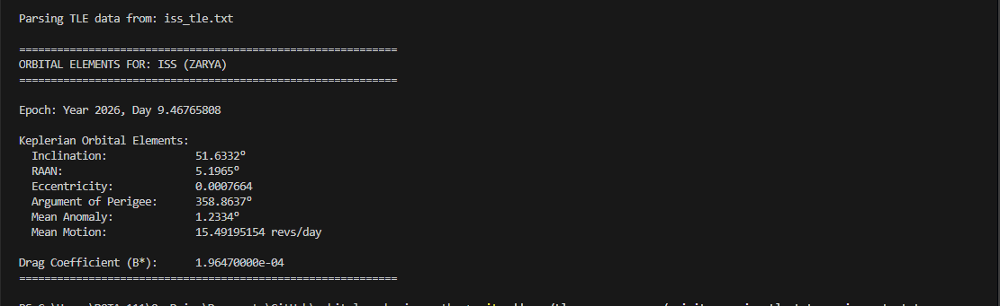
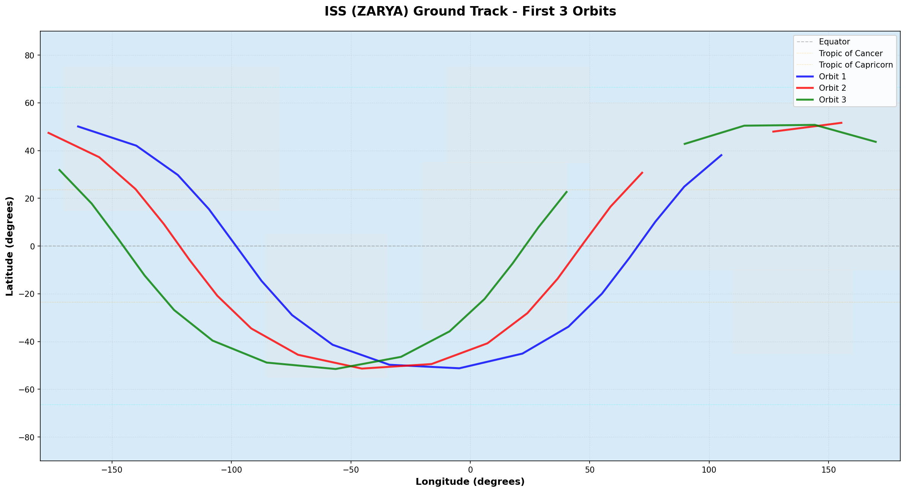

# Build Log - January 11, 2026 - Morning Session

## What I Built:
- ✅ TLE Parser (`src/tle_parser.py`)
- ✅ Parsed ISS orbital elements successfully

## What I Learned:
- **TLE Format:** 3 lines (name + 2 data lines)
- **SGP4 Library:** Industry standard for satellite propagation
- **Orbital Elements:**
  - Inclination: Orbit tilt relative to equator (ISS = 51.64°)
  - RAAN: Where orbit crosses equator going north
  - Eccentricity: Orbit shape (0 = circle, ISS ≈ 0.0006)
  - Mean Motion: Orbits per day (ISS ≈ 15.5)

## Challenges:
- **Mean Motion Conversion:** Initially got wrong units (rad/min vs revs/day)
- **Solution:** Conversion formula: `rad/min * 1440 / (2π)` = revs/day

## Screenshots:


## Next: Orbital Propagation Script
## Afternoon Session (Part 1): Orbital Propagation

### What I Built:
- ✅ Orbital Propagation Script (`src/orbital_propagation.py`)
- ✅ Calculated ISS position over 24 hours
- ✅ Generated CSV output with 49 position points

### What I Learned:
- **Orbital Propagation:** Predicting satellite position over time
- **Coordinate Systems:**
  - ECI (Earth-Centered Inertial): Fixed to stars
  - ECEF (Earth-Centered Earth-Fixed): Rotates with Earth
  - Geodetic: Lat/Lon/Alt
- **ISS Orbital Period:** 92.65 minutes (15.5 orbits/day)
- **Orbital Speed:** 7.69 km/s (27,600 km/h!)
- **Greenwich Mean Sidereal Time (GMST):** Tracks Earth rotation

### Challenges:
- **Coordinate Transformation:** Converting ECI to lat/lon requires accounting for Earth rotation
- **Solution:** Used GMST to rotate coordinates from inertial frame to Earth-fixed frame
- **Datetime Handling:** SGP4 uses Julian Date format, needed conversion

### Output:
- Terminal table showing 49 positions across 24 hours
- CSV file: `outputs/propagation_results.txt` (for plotting/analysis)

### Screenshots:


## Afternoon Session (Part 2): Ground Track Visualization

### What I Built:
- ✅ Ground Track Visualization Script (`src/ground_track_viz.py`)
- ✅ Generated 2 professional visualizations:
  - `iss_ground_track.png` - 6 hours continuous tracking
  - `iss_multiple_orbits.png` - 3 color-coded orbits

### What I Learned:
- **Data Visualization:** Using matplotlib to create publication-quality plots
- **Ground Tracks:** Visual representation of satellite path over Earth
- **Coordinate Plotting:** Handling lat/lon data on 2D maps
- **Antimeridian Problem:** Breaking lines at ±180° to avoid visual artifacts
- **ISS Orbital Characteristics:**
  - Inclination: 51.6° (visible in plot reaching ±50° latitude)
  - Westward shift: Earth rotation during orbit (visible between passes)
  - Coverage area: Between 51.6°N and 51.6°S

### Technical Challenges:
- **Discontinuity Handling:** Crossing ±180° longitude creates visual artifact
- **Solution:** Detect large longitude jumps, break line segments
- **Map Aesthetics:** Added land masses, equator, tropics for reference
- **Direction Arrows:** Show orbital motion direction for clarity

### Output:
- Two high-resolution PNG images (150 DPI)
- Professional appearance ready for portfolio/application
- Clear demonstration of ISS orbital mechanics

### Screenshots:



### Result:
✅ Complete orbital mechanics demonstration portfolio
✅ 3 working Python scripts
✅ Visual proof of capabilities
```

---

